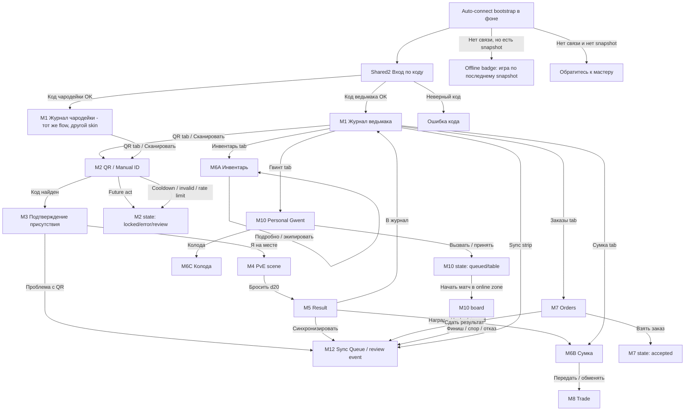
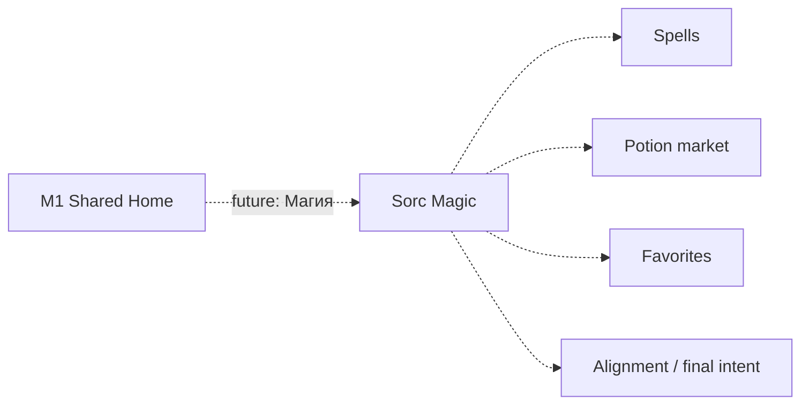

# Mobile witcher/sorceress shared UX flow v0.1

## iOS-only update

С 2026-06-09 этот shared flow реализуется в нативном SwiftUI iOS client под
`ios/`. Упоминания Godot ниже остаются historical/reference context для уже
сделанной работы в `mobile/`, но production acceptance больше не требует Godot
или Android. Экранная карта, state matrix и визуальные требования применяются
к iOS app, пока они не противоречат `docs/ios-native-plan.md`.

Документ фиксирует первый production-oriented мобильный флоу для ведьмаков и
чародеек. Для первой реализации у них одинаковый gameplay: персонаж,
offline-first snapshot, QR/manual PvE, награды, gear inventory, сумка, колода,
заказы, торговля, личные цели, репутация, sync и личный Gwent/PvP.
Чародейская магия, отдельный рынок зелий, фавориты, alignment evidence и
locked magical intent остаются future layer и не блокируют первый мобильный
релиз.

## Ревизия текущего состояния

- Канон уже требует mobile client для 11 мобильных ролей: 7 ведьмаков и
  4 чародейки.
- В `mobile/` уже есть shell: connection URL, player-code login, snapshot,
  bundled fallback, QR/manual ID, physical presence, offline event queue,
  single d20 PvE result and sync queue. Для production UX connection URL должен
  уйти из нормального player flow и остаться только как скрытая
  мастерская/диагностическая настройка.
- В `docs/ui/stage2b-screen-map.md` ведьмак уже описан как `W1-W10`.
- Чародейка была описана отдельным магическим контуром `Sorc1-Sorc7`. В V0
  этот контур отключается в UI и превращается в будущую вкладку/модуль.
- Мобильной онлайн-карты для ведьмаков/чародеек не нужно. Локацию подтверждает
  QR/manual ID плюс физическое присутствие у пропа или места.

## UX принцип для телефонов

- Основной режим - портретный телефон: iPhone и Android, 390x844 и 430x932 как
  целевые размеры.
- Все ключевые действия доступны большим нижним tab bar и крупными primary
  кнопками не меньше 44 px.
- На экране постоянно видны: персонаж, текущий акт из server snapshot,
  sync/offline статус и понятное состояние последнего действия.
- Offline-safe действия работают без Wi-Fi: просмотр snapshot, QR/PvE по
  локальному snapshot, результаты, cooldown, очередь событий.
- Online-only действия явно помечены: trade, Gwent match start/rounds, live
  order submit where server authority is required.
- Нормальный первый экран игрока - вход по коду. Подключение к локальному
  серверу происходит автоматически в фоне: app пробует встроенный game-day
  адрес, сохраненный адрес с регистрации/репетиции и последний успешный
  `server_url`. Если связи нет, игрок видит короткое состояние "нет связи,
  можно играть по последнему snapshot" или "обратитесь к мастеру", но не поле
  ручного URL.
- Чародейка в V0 получает тот же layout и те же кнопки, но другой portrait,
  role label и цветовой акцент. Нет отдельной кнопки "Магия" в основном
  bottom nav, чтобы не обещать неготовую игру.

## Навигационная модель

Bottom navigation на всех основных мобильных экранах:

| Tab | Экран | Назначение |
| --- | --- | --- |
| `Журнал` | `M1 Home / Journal` | Персонаж, ресурсы, цели, акт, sync |
| `QR` | `M2 QR / Manual ID` | Сканирование или ручной ввод кода |
| `Инвентарь` | `M6A Gear` | Оружие, защита, экипировка и активные бонусы |
| `Сумка` | `M6B Bag` | Предметы, зелья, артефакты и locked rewards |
| `Заказы` | `M7 Orders` | Доска заказов и активные поручения |
| `Гвинт` | `M10 Personal Gwent` | Вызовы, очередь, стол, ставка |

Колода Гвинта открывается из `M10` и как быстрый раздел `M6C Deck`, если
игрок хочет посмотреть/собрать карты без запуска PvP.

Sync strip находится сверху или снизу как persistent control:
`offline`, `pending`, `synced`, `sync_error`, `needs_master_review`.
Нажатие открывает `M12 Sync Queue`.

## Mermaid схема

## Экраны, кнопки и переходы

| ID | Экран | Основные элементы | Кнопки | Переходы |
| --- | --- | --- | --- | --- |
| `Ops0` | Скрытая настройка подключения | Сохраненный/встроенный server URL, connection QR, health status | `Проверить`, `Сохранить`, `Сбросить` | Только мастер/техник; в нормальном player flow не показывается |
| `Shared2` | Вход | Поле `player_code`, auto-connect status, роль после проверки | `Войти`, `Очистить` | ведьмак/чародейка -> `M1`; invalid -> same screen; нет связи без snapshot -> help state |
| `M1` | Журнал | Портрет, роль, уровень/XP, золото, репутация описательно, текущий акт read-only из server snapshot, цели, sync strip | `Сканировать`, `Синхронизировать`, tab buttons | QR -> `M2`; sync -> `M12`; tabs -> `M6A/M6B/M7/M10` |
| `M2` | QR / Manual ID | Camera area, manual opaque code field, last attempts, lock reasons | `Сканировать`, `Проверить код`, `Назад` | valid -> `M3`; future act -> locked state до объявления мастера/sync; invalid/cooldown -> state on `M2` |
| `M3` | Physical presence | Краткое описание сцены без скрытых наград, честное подтверждение | `Я на месте`, `Проблема с QR`, `Назад` | confirm -> `M4`; issue -> queued review in `M12` |
| `M4` | PvE scene | Hook, check/stat, modifiers, scene HP if needed, one-roll warning | `Бросить d20`, `Использовать предмет`, `Отступить` | roll -> `M5`; item drawer -> `M6B` overlay; retreat -> `M1` with local log |
| `M5` | Result | d20 log, success/failure, reward/cooldown, lock status | `В журнал`, `Синхронизировать`, `Открыть сумку` | home -> `M1`; sync -> `M12`; reward -> `M6B` |
| `M6A` | Инвентарь | Оружие, защита, экипировка, активные бонусы, требования статов | `Экипировать`, `Снять`, `Подробно`, `Назад` | equip/use -> local/server-visible state; back -> previous tab |
| `M6B` | Сумка | Предметы, зелья, артефакты, квестовые объекты, locked rewards | `Использовать`, `Передать`, `Подробно`, `Назад` | use -> result/error; transfer -> `M8`; locked stays blocked |
| `M6C` | Колода | Карты Гвинта, выбранная колода, row/type/rarity, deck validity | `Добавить`, `Убрать`, `Автособрать`, `Назад` | deck edit -> saved local/server deck state; back -> `M10` |
| `M7` | Orders | Public/addressed orders, accepted orders, escrow labels, object conflict | `Взять`, `Сдать`, `Отказаться`, `Обновить` | accept -> accepted state; submit -> `M12` or review; refresh online |
| `M8` | Trade | Incoming/outgoing, selected asset, recipient, price/mode | `Создать`, `Подтвердить`, `Отклонить`, `История` | online success -> pending/accepted state; offline -> blocked hint |
| `M9` | Goals section | Known personal goals and goal_tracks inside `M1` | `Развернуть`, `Свернуть` | no mutation; hidden flags never shown |
| `M10` | Personal Gwent | Challenge tokens, target, stake, queue/table, board entry | `Вызвать`, `Принять`, `К столу`, `Пас`, `Сыграть карту` | challenge -> queue/table; board actions -> match states; finish/review -> `M12` |
| `M12` | Sync Queue | Event list, per-event status, retryable errors, review/locked counters | `Синхронизировать`, `Повторить`, `В журнал` | accepted/rejected/review updates local state; home -> `M1` |

## Чародейка в V0

В первом production UI чародейка использует тот же основной мобильный flow.
Отличия только визуальные и текстовые:

- роль: `чародейка`, но без отдельной боевой магии;
- portrait/mark: чародейский портрет и серебряно-фиолетовый акцент;
- стартовые ресурсы берутся из snapshot, но отдельные mana/spell counters не
  выводятся как рабочие controls;
- зелья в `M6B Сумка` показываются как обычные предметы, если они уже есть в
  snapshot;
- future entry "Магия" можно показать только как disabled row в журнале с
  текстом для мастеров/тестировщиков, не как player-facing обещание.

Future layer после принятия V0:

## Event and backend contract

| UI action | Client behavior | Backend/read source | Visible result |
| --- | --- | --- | --- |
| Auto-connect | try built-in game-day URL, saved setup URL and last good server URL in background | `/health`, local settings | login screen with connection badge, offline badge or help state |
| Login | save/load `device_id`, request snapshot when online or open saved player snapshot when offline | `POST /api/auth/player-code`, `GET /api/content/snapshot`, local session/snapshot | `M1` or readable auth/error/offline state |
| QR lookup | local snapshot lookup, optional online lookup | snapshot `qr_objects`, optional `POST /api/qr/lookup` | valid scene, future act lock, cooldown or invalid |
| Physical presence | persist context and queue event | local `user://qr_event_context.json`, later sync | `M4` or review badge |
| PvE roll | generate one immutable d20, compute local result from snapshot | snapshot `pve_scenarios`, `mobs`, `rewards`; later `POST /api/events/sync` | `M5` result and queue badge |
| Sync | submit retryable event batch | `POST /api/events/sync` | accepted, duplicate, rejected, needs review, locked reward |
| Gear/inventory use | validate visible ownership, slot, stat requirements and lock state | player state/read model; item/potion endpoint where needed | updated gear/bag state or readable error |
| Deck edit | validate owned cards and deck constraints | player card/deck read model, Gwent rules | saved/invalid deck state |
| Orders | accept/submit with player auth | player-visible order board, lord order endpoint | accepted/submitted/review/error |
| Trade | online-only transfer with pending lock | trade transfer read model/endpoints | pending, accepted, declined, blocked offline |
| Gwent | online challenge/table/match actions | PvP/Gwent endpoints | queue, table, board, stake/review result |
| Act unlock | local unlock record, later server validation | snapshot unlock policy, sync validation | act content available or invalid code |

## Acceptance script for the team

1. Android and iPhone open the same build; app auto-connects in the background
   or shows an offline/help badge without asking players for URL.
2. Witcher starts from code login, downloads snapshot, restarts app, keeps `M1`.
3. Sorceress logs in and lands on the same core mobile flow with sorceress skin.
4. Witcher runs QR/manual -> physical presence -> PvE d20 -> result -> sync.
5. Sorceress runs the same QR/manual -> PvE route without magic controls.
6. Future act QR stays blocked until the master announces the act and the phone receives server sync.
7. Failure creates cooldown on the QR for that player only.
8. Locked reward is visible in `M6B` and cannot be spent, traded or staked.
9. `M6A` gear, `M6B` bag, `M6C` deck, order and trade screens show
   locked/review/offline states.
10. Personal Gwent can be opened from the shared tab and uses online-only states.
11. Stop server, create a local event, restart app, verify the queue survives.
12. Restore server, sync queue, verify accepted/review/rejected states remain
    readable without Swagger or manual SQLite edits.

## Implementation note

Keep code structure role-neutral first: `MobilePlayerHome`, `QrFlow`,
`PveScene`, `GearInventory`, `Bag`, `Deck`, `Orders`, `Trade`, `SyncQueue`,
`GwentEntry`.
Role-specific data should be a small skin/config object from snapshot:
`role_type`, `display_name`, `portrait_asset`, `accent`, `allowed_modules`.
For V0, `allowed_modules.magic=false` for sorceresses in the player-facing UI.
