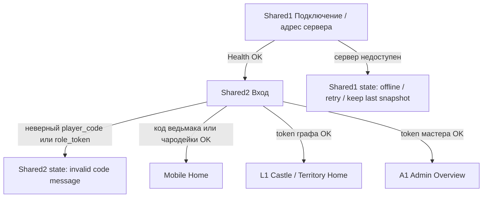
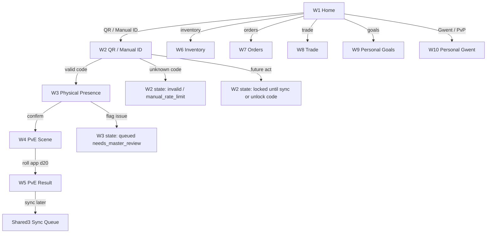
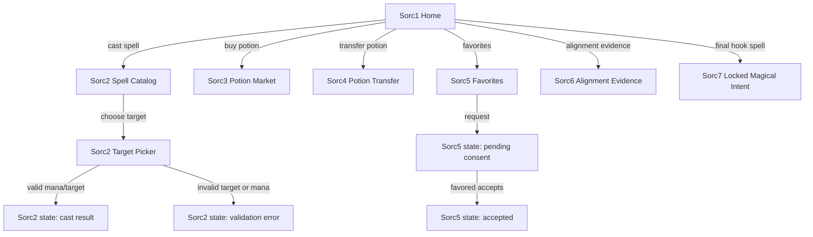
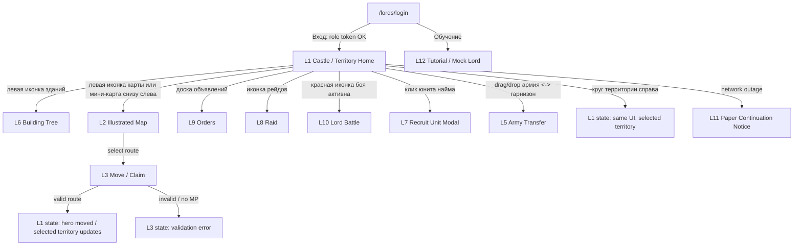
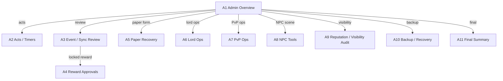

# Stage 2B screen map

Документ фиксирует карту экранов для `TASK-045`: какие поверхности должны
существовать до реализации Playable Role UI, какие роли ими пользуются, какие
состояния должны быть видимы и какие экраны позднее нужно визуально принять в
`TASK-067`.

Формат намеренно flow-first: это не финальный дизайн и не wireframes. Один
экран включает штатные состояния ошибки, offline, review и locked, если они не
меняют основной пользовательский маршрут.

## Conventions

- `W*` - экраны ведьмака на Godot mobile.
- `Sorc*` - дополнительные экраны чародейки на Godot mobile.
- `L*` - экраны графа/лорда в браузере на компьютере.
- `A*` - мастерские и NPC-master экраны в Admin Studio.
- `Shared*` - общие auth/sync/error экраны.
- Swagger, curl, API docs и ручная SQLite-правка не являются пользовательским
  маршрутом приемки для игроков и лордов.
- Бумажный режим является outage recovery и не заменяет отсутствующий штатный
  экран.

## Screen flow diagrams

### Общий вход

### Ведьмак: обычный игровой маршрут

### Чародейка: магический контур поверх player flow

### Граф: замок и территории на компьютере

### Мастер / NPC-master

## Shared screens

| Screen | Surface | Purpose | Primary actions | Read source | Mutation/event | Visibility | States | Visual acceptance |
| --- | --- | --- | --- | --- | --- | --- | --- | --- |
| `Shared1 Connection / Server URL` | Godot mobile, browser panels | Подключить клиента к локальному серверу | Ввести URL, проверить `/health`, принять connection QR payload | `/health`, saved local settings | Save local server URL | shared | server unreachable, retry, stale local data | TASK-067 mobile + desktop auth screenshots |
| `Shared2 Login` | Godot mobile, browser panels | Войти по игровому коду | Ввести `player_code` или `role_token` | local session, auth response | `POST /api/auth/player-code`, `POST /api/auth/role-token` | scoped by returned role | wrong token, invalid code, rejected device | TASK-067 auth screenshots |
| `Shared3 Snapshot / Sync Queue` | Godot mobile | Показать snapshot и очередь событий | Refresh snapshot, sync queue, retry failed sync | `GET /api/content/snapshot`, `user://event_queue.json`, `user://sync_status.json` | `POST /api/events/sync` | current player only | offline, pending, synced, sync_error, needs_master_review, duplicate, rejected | TASK-067 mobile sync states |

## Witcher mobile screens

| Screen | Purpose | Primary actions | Read source | Mutation/event | Visibility | States | Visual acceptance |
| --- | --- | --- | --- | --- | --- | --- | --- |
| `W1 Home` | Главный экран ведьмака | Open QR, inventory, orders, trade, goals, Gwent | player-scoped snapshot; player reputation endpoint when online | none | player-visible only; descriptive reputation | stale snapshot, offline, sync badge, final lock hint | mobile home screenshot |
| `W2 QR / Manual ID` | Найти QR/manual сцену | Scan QR text, enter manual ID | snapshot `qr_objects`, optional `POST /api/qr/lookup` | local QR context event if review needed | no hidden scene truth beyond visible snapshot row | unknown_qr, manual_rate_limit, future act locked, cooldown | QR/manual states |
| `W3 Physical Presence` | Подтвердить честность сцены | Confirm physical presence, flag issue | local QR context | queued `qr_scene_started` or `qr_attempt` | current player and master review | needs_master_review, honesty_violation_suspected | presence confirmation |
| `W4 PvE Scene` | Провести offline PvE | Roll app-generated d20 | snapshot `pve_scenarios`, `mobs`, `rewards`, player stats | local `pve_completed` event | current player; master sees roll log after sync | no editable d20, one-roll-only, scene already rolled | PvE roll/result |
| `W5 PvE Result` | Показать итог сцены | Review reward, return home, sync later | local PvE event, sync response | `POST /api/events/sync` through Shared3 | player sees local result; locked reward is explicit | success, failure cooldown, locked reward, pending sync, rejected | reward/cooldown/locked |
| `W6 Inventory` | Предметы, карты, артефакты, зелья | Use potion, start trade, inspect locked asset | player-scoped snapshot and player inventory read model blocker | `POST /api/players/{player_id}/potions/use`; trade endpoints | no master-only locks/reasons | locked asset, pending transfer, rejected use | inventory/trade states |
| `W7 Orders` | Заказы лордов | Accept, submit success | player order board read model blocker | `POST /api/lords/{lord_id}/orders` with player auth | public/addressed visible only | active cap, object conflict, contested_review | orders list/state |
| `W8 Trade` | Торговля online-only | Create, accept, decline transfer | trade transfer read model blocker | `POST /api/trade-transfers`, accept, decline | participants and master only | pending_locked, accepted, declined, contested_review | trade states |
| `W9 Personal Goals` | Личные цели и прогресс | Inspect known goals | snapshot `personal_goals`, `goal_tracks` | none in player UI | hidden `goal_flags` redacted | locked final hook, stale snapshot | goals screenshot |
| `W10 Personal Gwent` | Личный PvP/Gwent | Challenge, queue/table, start, round, pass, finish, refusal | `GET /api/pvp/tables`; Gwent match read model blocker | `POST /api/pvp/challenges`, start, rounds, finish, refusal | participants and master only | queued, active challenge cap, table full, needs_master_review, locked stake | mobile Gwent table |

## Sorceress mobile screens

| Screen | Purpose | Primary actions | Read source | Mutation/event | Visibility | States | Visual acceptance |
| --- | --- | --- | --- | --- | --- | --- | --- |
| `Sorc1 Home` | Главный экран чародейки | Open magic, potions, favorites, alignment, shared player flows | `GET /api/sorceresses/{sorceress_id}/state`, snapshot | none | current sorceress and master | stale/offline, mana tick pending, final lock hint | sorceress home |
| `Sorc2 Spell Catalog` | Заклинания и цели | Choose spell, choose target, cast | sorceress state `spells`, `mana`, allowed targets | `POST /api/sorceresses/{id}/spells/cast` | visibility from spell/effect rules | insufficient mana, invalid target, needs_master_review | spell cast states |
| `Sorc3 Potion Market` | Купить зелья | Buy wholesale potion | sorceress state `potion_market`, gold | `POST /api/sorceresses/{id}/potions/buy` | sorceress and master | insufficient gold, unavailable potion, duplicate | potion market |
| `Sorc4 Potion Transfer` | Передать/продать зелье | Select recipient, price, mode, send | sorceress state; trade read model blocker | `POST /api/sorceresses/{id}/potions/transfer` | participants and master | pending_locked, accepted, declined, favorite-only target error | potion transfer |
| `Sorc5 Favorites` | Consent-based favorites | Request primary/secondary, accept if target | sorceress state `favorites`; player pending favorite read blocker | `POST /api/favorites`, `POST /api/favorites/{id}/accept` | sorceress, favored player, master | pending consent, cap exceeded, duplicate, change limit | favorite consent |
| `Sorc6 Alignment Evidence` | Зафиксировать интригу/лояльность | Record evidence | sorceress state `alignment` | `POST /api/sorceresses/{id}/alignment-evidence` | by event visibility; master sees full | public/private evidence, review | alignment evidence |
| `Sorc7 Locked Magical Intent` | Финальная магическая воля | Cast/record final-hook intent | sorceress state `locked_magical_intent` | spell cast or alignment evidence endpoint | master sees review reason | accepted locked, after final lock needs_master_review | locked intent |

## Lord desktop screens

| Screen | Purpose | Primary actions | Read source | Mutation/event | Visibility | States | Visual acceptance |
| --- | --- | --- | --- | --- | --- | --- | --- |
| `L1 Castle / Territory Home` | Главный экран после входа: замок или выбранная территория | Hover/click circular action icons, switch owned territory, open minimap/map, drag army/garrison, open recruit modal, logout, replay tutorial | `GET /api/lords/{lord_id}/state` plus selected `territory_id` | none directly; actions open scoped screens/modals | lord-scoped | wrong token, stale state, active battle alert, selected territory unavailable | lord castle/territory home |
| `L2 Illustrated Map` | Полноэкранная стратегическая карта `venue_map_v1` | Select node/route/territory, return to selected territory UI | lord state `map_nodes`, `map_edges`, territories | none until move | own full state; enemy redactions | owner/neutral/contested, excluded zones hidden/no-play | illustrated map |
| `L3 Move / Claim` | Движение и захват | Select route, submit move | lord state route preview | `POST /api/lords/{lord_id}/move` | lord-scoped; contested visible to lords | no MP, invalid route, contested, battle required | move/claim states |
| `L4 Territory Detail` | Тот же UI для конкретной захваченной территории | Inspect local income, garrison, recruit stock, local building tree | lord state selected territory, garrisons, recruit stock, building tree | none until action | own garrison visible; enemy hidden/redacted | owner, contested, capacity, hero not here locks top army lane | territory home variant |
| `L5 Army Transfer` | Переброска армии и гарнизона из нижних рядов | Active to garrison, garrison to active, reserve to active where allowed | lord state active army location, reserve, garrisons | `POST /api/lords/{lord_id}/garrisons/transfer` | lord-scoped | capacity, minimum garrison, active battle lock, selected territory not hero location | transfer UI/modal |
| `L6 Building Tree` | Дерево построек выбранной локации | Select building, inspect bonus branch, buy/upgrade | lord state buildings/catalog scoped by selected `territory_id` | `POST /api/lords/{lord_id}/buildings` | lord-scoped | locked, unlocked, purchased, missing prerequisite, insufficient gold | castle/territory tree |
| `L7 Recruit Unit Modal` | Покупка накопленных войск выбранной локации | Open unit widget, choose quantity by slider, hire into garrison | lord state recruit stock for selected `territory_id` | `POST /api/lords/{lord_id}/recruit` | lord-scoped | locked slot, insufficient stock/gold, purchased to garrison | recruit unit modal |
| `L8 Raid` | Рейд без 5x6 боя | Choose target, start raid | lord state raid tokens/effects/targets | `POST /api/lords/{lord_id}/raids` | effects visible by rules | invalid target, no token/gold, debuff/loot, expiry | raid screen |
| `L9 Orders` | Заказы графа | Create public/addressed order | lord state orders | `POST /api/lords/{lord_id}/orders` | public/addressed; escrow redactions as needed | active cap, escrow lock, object conflict, review | order screen |
| `L10 Lord Battle` | Синхронный бой 5x6 | Deploy, move, attack, defend, surrender, auto | `GET /api/lord-battles`, `GET /api/lord-battles/{id}` | `POST /api/lord-battles`, `POST /api/lord-battles/{id}/actions` | battle participants and master | legal action, timer, timeout, auto-resolve, takeover | 5x6 board |
| `L11 Paper Continuation Notice` | Outage-only fallback | Read continuation instructions | last known lord state and printed sheets | later `paper_lord_action`/`paper_lord_battle` via Admin | paper operator/master | outage only, not normal acceptance | paper notice |
| `L12 Tutorial / Mock Lord` | Обучение лорда перед игрой | Walk through mock castle, territory, map, orders, raid, recruit and battle states | static mock state plus fixture lord state | no mutation | training only | can be replayed from `?` button | tutorial flow |

## Master / NPC-master desktop screens

| Screen | Purpose | Primary actions | Read source | Mutation/event | Visibility | States | Visual acceptance |
| --- | --- | --- | --- | --- | --- | --- | --- |
| `A1 Admin Overview` | Мастерская сводка | Navigate, refresh, inspect blockers | `GET /api/master/admin/overview`, `GET /api/master/state` | none | master-only | wrong token, blocking alerts | admin overview |
| `A2 Acts / Timers` | Акты, объявления, коды | Start act, record announcement, reveal code | `GET /api/master/acts/state`, `GET /api/master/timers` | `POST /api/master/acts/{id}/start`, physical-announcement, unlock-code reveal | master-only | code hidden until announcement, final lock | acts/timers |
| `A3 Event / Sync Review` | Очередь событий и review | Approve/reject/correct events | `GET /api/master/state`, `GET /api/master/review-queue` | `POST /api/events/{event_id}/review` | master-only | P0/P1/P2/P3, duplicate, rejected | review queue |
| `A4 Reward Approvals` | Locked rewards | Approve, reject, correct | `GET /api/master/state` reward approvals | `POST /api/master/reward-approvals/{approval_id}` | master-only | pending, approved, rejected, corrected | reward approval |
| `A5 Paper Recovery` | Внести бумажное событие | Choose form, enter fields, submit | `GET /api/master/state` for context | `POST /api/events/sync` with `source=paper_recovered` | master-only | duplicate, conflict, needs_master_review | paper recovery |
| `A6 Lord Ops` | Операции карты/лордов | Inspect/correct map, garrisons, battles, pending rewards | `GET /api/master/state` | `POST /api/master/game-ops/corrections` | master-only | correction requires reason/operator | lord ops |
| `A7 PvP Ops` | PvP throttle and reviews | Set throttle, inspect tables/refusals | `GET /api/pvp/tables`, `GET /api/master/state` | `POST /api/master/pvp-throttle`, review endpoints | master-only | normal, limited, paused, timeout review | PvP ops |
| `A8 NPC Tools` | King/Wanderer events | Record/resolve event/deal | `GET /api/master/npc/events`, `GET /api/master/npc/deals` | `POST /api/master/npc/events`, resolve | master-only for hidden prices | hidden price, final flag, severity | NPC tools |
| `A9 Reputation / Visibility Audit` | Видимость и репутация | Inspect exact values, change reputation, audit redactions | `GET /api/master/reputation/{id}`, `GET /api/master/visibility-audit` | `POST /api/master/reputation/{id}/change` | master-only | redaction failure blocks UI acceptance | visibility audit |
| `A10 Backup / Recovery` | Backup status | Run backup, inspect status | `GET /api/master/backups/status` | `POST /api/backups/run` | master-only | restore remains TASK-036 residual-risk path | backup |
| `A11 Final Summary` | Финальная сводка | Inspect evidence, add note, export | `GET /api/master/final-summary` | `POST /api/master/final-summary/notes` | master-only by default | missing evidence, pending locks, locked magical intent | final summary |

## Visual acceptance handoff for TASK-067

`TASK-067` must turn this screen map into visual acceptance artifacts before
role UI implementation tasks start. Required screenshot/prototype set:

- mobile: `Shared1`, `Shared2`, `Shared3`, `W1-W10`, `Sorc1-Sorc7`;
- lord desktop: `L1-L10` plus outage-only `L11` notice;
- Admin desktop: `A1-A11`;
- state variants: invalid code, server unreachable, offline snapshot, pending
  sync, sync error, needs master review, rejected, duplicate, cooldown, locked
  reward, wrong token, hidden-data redaction, final lock;
- visual reference surfaces: lord castle/territory home matching the reference
  composition, illustrated lord map, castle/territory building tree, thematic
  territory backgrounds/forts, personal Gwent table, visually distinct 5x6 lord
  battle board.

All production visual assets must be original/local/generated. References define
layout, density, mood and affordances only.
